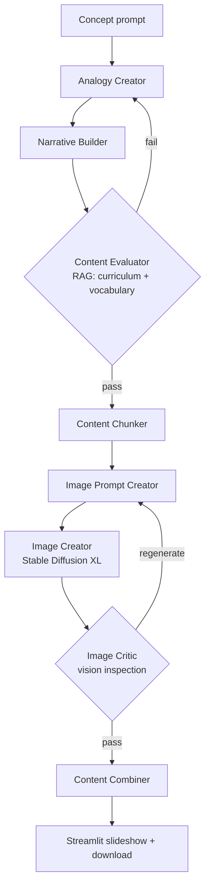

# StAnify 📚

**A multi-agent system for analogy-driven and visual learning in primary education.**

MSc thesis project (Distinction) — University of Birmingham, School of Computer Science. Supervised by Dr Mohammed Bahja. **Full thesis: [docs/thesis.md](docs/thesis.md).**

StAnify turns a Key Stage 1–2 concept ("If you have 8 apples and eat 3, how many are left?") into a complete, classroom-ready package: an analogy-driven narrative, 4–6 curriculum-aligned illustrations, teacher guidance notes, and assessment items — in ~3 minutes, for ~$0.15 per concept.

## Results (blinded study, 30 evaluators, 270 evaluations)

StAnify was compared against GPT-5 and GPT-4 across mathematics, physics/chemistry, and biology concepts, blind-labeled A/B/C:

| | StAnify | GPT-5 | GPT-4 |
|---|---:|---:|---:|
| **Preferred by evaluators** | **64.4%** (58/90) | 33.3% | 2.2% |
| Engagement (mean /5) | **4.17** | 3.74 | 2.66 |
| Accuracy (mean /5) | 4.21 | 4.48 | 3.92 |
| Overall score (mean /5) | 3.93 | 4.00 | 2.79 |

- Preference for StAnify is statistically decisive (χ² = 52.27, p ≈ 1e-11); overall scores are statistically comparable to GPT-5 (paired t-test p = 0.685) while significantly above GPT-4 (p < 0.0001).
- The pattern: GPT-5 wins on polish, StAnify wins on **pedagogy** — evaluators chose the system that teaches over the system that explains.
- **17–25x faster** than unaided teacher preparation (50–80 min → ~3 min); ~3–5x faster than a teacher drafting with GPT-4/5.

## Architecture

Eight CrewAI agents behave like a miniature school staffroom, with a Qdrant vector database holding curriculum data, an age-graded vocabulary bank, and visualization scaffolds:

| Agent | Role |
|---|---|
| Analogy Creator | Maps the concept to everyday child experiences |
| Narrative Builder | 300–500 word story embedding the analogy and scaffolded vocabulary |
| Content Evaluator | Scores lawfulness, relevance, analogy quality, vocabulary; **rejects and loops** below threshold |
| Content Chunker | Segments the narrative, marks highlights worth visualizing |
| Image Prompt Creator | Turns highlights into age-appropriate prompts using visualization tips |
| Image Creator | Stable Diffusion XL (txt2img / img2img for continuity) |
| Image Critic | Vision-inspects every image for relevance, safety, appropriateness; can force regeneration |
| Content Combiner | Assembles narrative, images, teacher notes, and assessment items |



The two evaluation loops (text and image) are the zero-hallucination mechanism: nothing reaches a child without passing a rubric-scored check against the curriculum database.

## Cost profile

~$0.14–0.16 per complete concept package: image generation is ~80% of cost (SDXL, 4–6 images), LLM calls ~14% (GPT-4o-mini across six agents, ~3.5k tokens), vision evaluation and embeddings the remainder.

## Repository contents

```
docs/thesis.md      the complete MSc thesis — methodology, evaluation design, full results
docs/               agent roles, orchestration flow, CrewAI notes
main.py             minimal CrewAI demo of the planner→scene pattern
pipeline/           orchestration config
```

This repo holds the project's documentation, scaffold, and full write-up; the experimental system (agents.yaml/tasks.yaml configs, RAG tools, Stability/vision integrations, Streamlit UI) was built for the MSc project as described in the thesis.

## Citation

> Irfan, H. (2025). *StAnify: A Multi-Agent System for Analogy-Driven and Visual Learning in Primary Education.* MSc Thesis, University of Birmingham.

---

**Haadhi Irfan** — [haadhi76.github.io/Portfolio](https://haadhi76.github.io/Portfolio/) · [LinkedIn](https://www.linkedin.com/in/Haadhi) · haadhi.irfan@gmail.com
