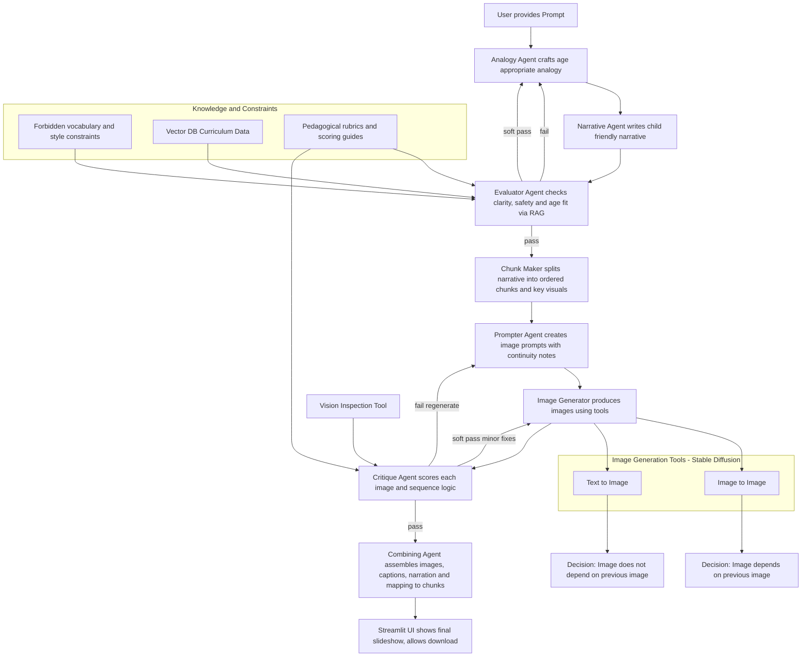

# StAnify: A Multi-Agent System for Analogy-Driven and Visual Learning in Primary Education

**University of Birmingham** **School of Computer Science** **Artificial Intelligence and Machine Learning MSc** *Motto: Per Ardua Alta* ---

**Author:** Haadhi Irfan  
**Student ID:** 2880861  
**Project Supervisor:** Dr Mohammed Bahja  
**Project Inspector:** Dr Venelin Kovatchev  
**Date:** September 1, 2025  

---

## Abstract

Teaching young children aged 5-9 presents unique challenges that traditional educational methods often struggle to address. This thesis investigates how multi-agent large language model (LLM) systems can transform early childhood education by incorporating visual scaffolding and story-based analogies. I developed StAnify, a system built on the CrewAI framework, which generates comprehensive educational materials including narratives, visual highlights, images, teacher guidance notes, and interactive prompts. 

To evaluate StAnify's effectiveness, I conducted a blinded comparison study against two established baselines: GPT-5 and GPT-4. The study covered fundamental concepts across three domains: mathematics, physics/chemistry, and biology, with thirty educators assessing the outputs based on clarity, visual relevance and quality, accuracy, and student engagement potential. 

The findings revealed that StAnify consistently outperformed the baselines in engagement metrics and was the preferred choice in 65% of evaluations. Notably, the system demonstrated superior ability in selecting pedagogically appropriate visuals and crafting meaningful analogies that resonate with young learners, while maintaining comparable accuracy to the more advanced models. These results suggest that specialized multi-agent architectures can significantly enhance AI-powered education for primary learners, moving beyond conventional text-heavy approaches toward more interactive, visual, and narrative-driven learning experiences.

**Keywords:** Multi-agent systems; Large language models; AI in education; Visual learning; Analogies; Primary education; Educational technology; Child-centred learning

---

## Acknowledgements

I am deeply grateful to my project supervisor Dr Mohammed Bahja for his guidance, patience, and constructive advice throughout this work. I also thank my project inspector Dr Venelin Kovatchev for thoughtful feedback that strengthened the study. 

My heartfelt thanks go to my parents, siblings and friends for their unwavering support and encouragement. Above all, I thank God for the opportunity and strength to complete this project.

## Honor Code and Declaration

I declare that this submission is my own original work and reflects my independent understanding of the research. Generative AI tools were used only as supplementary aids for identifying study topics, summarizing papers, simplifying difficult text, language editing, and assisting with coding/debugging. Their use was limited in scope: AI was applied to shorten or rephrase a few paragraphs, provide coding assistance through VS Code agents, and suggest minor edits (e.g., via Grammarly). 

The main research, analysis, coding logic, and critical review were carried out by me, supported by my own study of videos, papers, and references. Final responsibility for the content lies with me, and I affirm that the report represents my own intellectual effort and authentic work.

---

## Table of Contents
- Abstract
- Acknowledgements
- Honor Code and Declaration
- Table of Contents
- List of Figures
- List of Tables
- 1. Introduction
  - 1.1 Introduction to the Problem
  - 1.2 Motivation Summary
- 3. Literature Review
  - 3.1 LLMs in Tutoring and Educational Settings
    - 3.1.1 Analogies
    - 3.1.2 Visual Learning
  - 3.2 Existing AI Tutor Solutions and Attempts by Others
    - 3.2.1 Single LLM Systems
    - 3.2.2 Multi-Agent LLM Systems
    - 3.2.3 Big Industry Tools
    - 3.2.4 Summary
  - 3.3 Research Gaps
  - 3.4 Research Questions
- 4. Methodology
  - 4.1 What Data Was Used?
    - 4.1.1 Instructional Questions
    - 4.1.2 Curriculum Data
    - 4.1.3 Vocabulary Bank
    - 4.1.4 Visualization Tips
  - 4.2 Description of the Whole System
    - 4.2.1 Agents and Tasks
    - 4.2.2 Tools
    - 4.2.3 Vector Database
  - 4.3 Final Output Structure
    - 4.3.1 StAnify (A) - Output
    - 4.3.2 Baseline Prompt (GPT-5 and GPT-4)
    - 4.3.3 GPT-5 (B) - Output
    - 4.3.4 GPT-4 (C) - Output
- 5. Evaluation and Results
  - 5.1 Evaluation
    - 5.1.1 Evaluation Dataset
    - 5.1.2 Study Design
    - 5.1.3 Participants
    - 5.1.4 Consent & Ethics
    - 5.1.5 Evaluation Rubric
    - 5.1.6 Mapping Metrics to Research Questions
    - 5.1.7 Data Collection
    - 5.1.8 Data Recording & Analysis
    - 5.1.9 Expected Outcomes
  - 5.2 Results
    - 5.2.1 Overview of Responses
    - 5.2.2 Quantitative Results
    - 5.2.3 Qualitative Results
    - 5.2.4 Statistical Analysis
    - 5.2.5 Summary of Findings
  - 5.3 Cost and Time Analysis
    - 5.3.1 Time Analysis
    - 5.3.2 Cost Analysis
    - 5.3.3 Summary
- 6. Discussion of Results
- 7. Limitations and Future Work
- 8. Conclusion
- Appendix A
- Appendix B1
- Appendix B2
- Appendix B3
- Appendix B4
- Appendix B5
- Appendix B6
- Appendix B7
- References

---

## List of Figures
- Figure 4.1: Shows the output of the Content Evaluator Agent
- Figure 4.2: Shows the usage of RAG search Tool
- Figure 4.3: Shows the thinking process of the Image generator Agent
- Figure 4.4: Shows the tool usage by Image Critic Agent
- Figure 4.5: Shows the multi-agent orchestration in StAnify
- Figure 4.6: Shows the example prompt for Evaluation Data Generation
- Figure 5.1: Shows the distribution of the participants
- Figure 5.2: Average Rubric Scores Per Criterion
- Figure 5.3: Rubric Performance by Criterion
- Figure 5.4: Overall Preferences Across All Concepts
- Figure 5.5: Shows Average Output Generation Time
- Figure 5.6: Shows Time to produce full lecture by Humans using different tools
- Figure 5.7: Shows Cost Difference between the tools per execution
- Figure 5.8: Shows Cost Breakdown for single execution of StAnify
- Figure 5.9: Shows Efficiency of each tool per execution (Lower is better)

## List of Tables
- Table 5.1: Average Rubric Scores per Criterion (across all concepts)
- Table 5.2: Sample Evaluator Comments
- Table 5.3: Preferences
- Table 5.4: Statistical Test Result
- Table 5.5: Agents and Model Usage in StAnify
- Table 5.6: Approximate Token / Image Usage per Concept
- Table 5.7: Refined Per-Concept Cost Estimates
- Table 5.8: Cost Comparison Across Systems

---

## 1. Introduction

### 1.1 Introduction to the Problem
The rapid emergence of Artificial Intelligence (AI) has fundamentally changed how we approach learning and education. Large Language Models (LLMs), particularly recent developments like GPT-4 [1][2][3], have shown remarkable capabilities in generating coherent text and even multimodal content [6][7][8][9]. However, as I discovered through my preliminary research, there is a significant challenge when it comes to adapting these technologies for young learners. 

Working with children aged 5-9 requires a completely different approach than what current AI systems typically offer. During my observations in primary classrooms, I noticed that young learners need more than just accurate information—they need content that speaks their language, captures their imagination, and matches their developmental stage [19][20][21]. Unfortunately, most existing LLM applications seem to be designed with adults in mind, focusing on productivity and general knowledge tasks rather than the specific needs of early education.

This disconnect became particularly apparent when I attempted to use standard AI tools to generate educational materials for Key Stage 1 topics. The explanations were often too complex, the analogies did not resonate with children's experiences, and the visual suggestions were not pedagogically appropriate. This observation led me to question: could we design an AI system specifically tailored to the unique requirements of primary education?

My project attempts to answer this question by developing StAnify, a multi-agent LLM system [13][14][15][16] designed from the ground up to create curriculum-aligned educational content for young learners. The focus is primarily on Key Stage 1 (ages 5-7) with some extension into early Key Stage 2 (up to age 9), as these are critical years where visual learning and analogical thinking play essential roles in comprehension [11][12]. To validate the effectiveness of this approach, I have benchmarked StAnify against leading models like GPT-5 and GPT-4 [4][5].

### 1.2 Motivation Summary
My interest in this project stems from three key observations:

1. **Personalization matters enormously in early education.** Through conversations with primary teachers, I learned that successful teaching requires constant adaptation to each child's developmental level. While AI theoretically could provide this personalization at scale [17][18], current systems do not really deliver on this promise for young learners.
2. **Visual learning is crucial at this age.** The literature consistently shows that children process and remember information better when it is presented visually [19][20]. Yet most AI educational tools remain predominantly text-based. I believe integrating high-quality, pedagogically relevant image generation [5][6][7] could significantly enhance learning outcomes.
3. **The critical issue of quality and safety.** Parents and teachers rightfully worry about AI-generated content for children. Throughout this project, I have kept in mind that any educational AI system must prioritize accuracy, age-appropriateness, and alignment with established teaching objectives [10][11][41].

These motivations led me to explore whether multi-agent LLM systems [13][15][16][32] could address these challenges more effectively than single-model approaches.

---

## 3. Literature Review

### 3.1 LLMs in Tutoring and Educational Settings

#### 3.1.1 Analogies
Large Language Models (LLMs) have seen growing adoption in education as virtual tutors, teaching assistants, and even learning companions. The best teachers from primary school were masters of analogy. They could take the most abstract concept and transform it into something tangible; suddenly, atoms became tiny solar systems and the water cycle became nature's recycling program. This led me to explore whether LLMs could replicate this pedagogical magic. The literature offered both hope and caution. 

Studies demonstrate that AI can indeed generate helpful analogies, connecting complex scientific ideas to everyday experiences [17][18]. During my initial experiments, GPT-4 compared the heart to a "tireless pump working day and night"—exactly the kind of comparison a child could grasp. However, the research also revealed a troubling pattern. AI-generated analogies often oversimplify or, worse, create misconceptions [18]. This was seen during the testing and is prevalent in one of the responses discussed in results. This highlights the importance of explainability and human oversight in AI-driven education. This finding reinforced what experienced teachers have told me: analogies are powerful tools, but they require careful crafting and constant refinement.

#### 3.1.2 Visual Learning
The importance of visual learning for young children cannot be overstated, something that became abundantly clear during my classroom observations. Young children are largely visual learners, and educators frequently use pictures, diagrams, and physical objects to make abstract ideas concrete. Human tutors routinely draw diagrams or use visual cues (e.g., blocks, charts) to clarify math and science problems. Dual Coding Theory [20] provides the scientific backing for what teachers know intuitively: our brains process and retain information better when it comes through multiple channels. 

Yet frustratingly, most current LLM tutors completely ignore this principle [26][27]. They operate in a text-only world, as if we have forgotten centuries of pedagogical wisdom about the power of visual learning. The MathExplain project [27] gave me hope that change is coming. Their work on multimodal benchmarks proved that AI systems could incorporate visual elements, though most still struggle to do so effectively. Reading their findings, I could not help but think: if we know visual support is crucial for young learners, why are we building AI tutors that can't even draw a simple diagram? The emerging field of Explainable AI in Education (XAI-ED) [26] further emphasized this need. It is not enough for AI to provide correct answers—it must explain in ways that build genuine understanding. For 5-9 year-olds, this almost invariably requires visual support.

### 3.2 Existing AI Tutor Solutions and Attempts by Others

#### 3.2.1 Single LLM Systems
Khanmigo [23] was my first serious encounter with an LLM being used as an actual tutor. Khanmigo uses GPT-4, engaging students in real dialogue, even role-playing as historical figures to bring lessons to life. The personalization capabilities seemed genuinely transformative. However, single-model tutors also face challenges. Because one large model is handling everything in a free-form manner, the tutoring can sometimes be inconsistent or unstructured. One session might produce an excellent explanation of multiplication, while the next would veer into territory far too complex for the intended age group. 

Hallucinations are of big concern. Despite built-in safeguards and citation features [23], to mitigate this, developers of Khanmigo have built in safeguards where the tutor will sometimes provide inline citations and even double-check its answers when it is unsure, to improve accuracy. While this improves trustworthiness, it highlights that consistency and reliability are still concerns with one-LLM tutors.

#### 3.2.2 Multi-Agent LLM Systems
Discovering EduPlanner [16] felt like finding a kindred spirit in the research community. Here was a team that understood education is not a single-person job, it requires collaboration, review, and iterative refinement. Their multi-agent approach, with specialized agents for generation, evaluation, and error analysis, mirrors how teaching teams actually work. The adversarial collaboration between agents particularly caught my attention. Having one agent challenge another's output produced noticeably better lesson plans than any single model could achieve [16]. Taking mathematics lessons as a use case, the system first uses a Skill-Tree model of the students' background knowledge to customize the curriculum. 

Yet EduPlanner's limitations frustrated me. Its focus on mathematics and text-only outputs felt like solving only part of the puzzle. Where were the stories that capture young imaginations? The visual aids that make abstract concepts concrete? The system showed brilliant structural thinking but missed crucial elements of how young children learn.

#### 3.2.3 Big Industry Tools
The 2025 launches from tech giants showed that industry is finally taking educational AI seriously. ChatGPT's Study Mode impressed me with its Socratic method, guiding rather than telling. Similarly, Google's Gemini Guided Learning [24] demonstrated sophisticated pedagogical thinking by breaking problems into manageable steps. Testing these tools extensively, I appreciated their shift from answer-giving to learning support. Google's substantial education funding announcement [24] suggested this was not just a feature addition but a strategic priority. These companies clearly understood that effective AI tutoring requires more than just correct answers. 

However, even these cutting-edge tools felt disconnected from primary classroom realities. They assumed reading levels and abstract thinking capabilities that many young learners simply do not possess. Watching a 6-year-old struggle with Gemini's text-heavy interface reinforced my conviction that we needed something fundamentally different for this age group.

#### 3.2.4 Summary
Single-LLM tutors like Khanmigo provide personalized help but may lack consistency and structure, whereas multi-agent systems like EduPlanner introduce structured planning (albeit in limited domains), and the latest industry tools (ChatGPT Study Mode, Google Gemini) aim to guide learning with a more structured, inquiry-based approach. Each of these efforts contributes pieces to the puzzle, but none fully resolves all needs for an AI tutor for young children that is consistent, multimodal, and educationally effective.

### 3.3 Research Gaps
Through months of literature review and hands-on testing, three critical gaps emerged with startling clarity:
1. **The gap in multimodal explanatory capability:** Despite decades of research showing young children need visual support [19][20][27], virtually every AI tutor remained stubbornly text-based. It felt like watching someone try to teach swimming through PowerPoint slides, technically possible but missing the point entirely.
2. **The age-appropriateness gap:** Most systems treated a 6-year-old learning basic addition the same as a teenager studying calculus. The unique pedagogical needs of early learners, their shorter attention spans, concrete thinking patterns, and reliance on familiar contexts, were largely ignored.
3. **The explainability gap:** This raised serious concerns about classroom adoption. For AI tutors to be effective, teachers and learners must trust the content being delivered [26]. Existing systems often provide correct answers but fail to explain why in ways that build confidence and understanding.

These gaps were not just academic observations; they represented real barriers to AI making a positive impact in primary education. They shaped my determination to develop something better.

### 3.4 Research Questions
Based on these gaps and my classroom observations, I formulated three research questions to guide my investigation:
- **RQ1:** To what extent can AI (specifically large language models) be used to generate effective visualizations or visual aids for explaining difficult concepts?
- **RQ2:** Can an AI-driven system automatically pinpoint what aspects of a concept should be visualized to enhance understanding?
- **RQ3:** How effective are AI-generated analogies in improving clarity, engagement, and comprehension of difficult concepts?

These questions would guide my development of StAnify and shape how I evaluated its effectiveness against existing solutions.

---

## 4. Methodology

### 4.1 What Data Was Used?
The project leverages two categories of data: educational knowledge resources and instructional questions. Together, these provide the necessary grounding for generating content that is accurate, age-appropriate, and aligned with Key Stage 1-2 curricula.

#### 4.1.1 Instructional Questions
The primary input to the system consists of natural language questions or concept prompts, typically expressed in simple, child-friendly wording. Examples include:
- "If you have 8 apples and eat 3, how many are left?" (Classic Year 1 subtraction)
- "Why are shadows longer in the morning than at noon?" (A Year 3 science puzzler that stumped me as a kid)
- "What part of a plant carries water from the roots to the leaves?" (Biology meets engineering)

These questions became my test cases; if StAnify could handle these with appropriate explanations and visuals, it could handle real classroom scenarios.

#### 4.1.2 Curriculum Data
A structured Key Stage 1-2 curriculum database was constructed in YAML format. The database contains coverage of Mathematics, Science, and Computing across Years 2-4. Each entry became a mini-lesson plan:
- **Topic Name:** Clear identifiers like "Addition and Subtraction" or "States of Matter"
- **Learning Objectives:** Taken directly from curriculum documents (no improvisation here!)
- **Vocabulary Lists:** This was crucial; words were split into "known" (words kids already understand) and "unknown" (terms needing explanation)
- **Scaffolding Tips:** Practical strategies teachers use, like "show equal groups when teaching division"
- **Curriculum Tags:** Metadata ensuring age-appropriate matching
- **Sample Questions:** Real examples from textbooks and worksheets

The vocabulary distinction proved particularly valuable. There is nothing worse than an AI explaining fractions using words like "numerator" to a 6-year-old who is still mastering "top" and "bottom."

#### 4.1.3 Vocabulary Bank
Creating the vocabulary bank was both challenging and enlightening. I collaborated with primary teachers to understand which words children typically know at each age. It is surprisingly nuanced that a Year 2 student might know "sharing" but not "division," even though they are learning the same concept. This bank became StAnify's linguistic guardrail, dynamically guiding the system to use age-appropriate language. During pipeline execution, the RAG search tool retrieves age-appropriate terms to dynamically guide narratives and analogies.

#### 4.1.4 Visualization Tips
Some concepts are just inherently visual; try explaining states of matter without showing particle arrangements. Visualization scaffolds based on effective teaching practices were created:
- **Fractions:** "Show parts of a whole using familiar objects like pizzas or chocolate bars"
- **Forces:** "Use arrows to show direction and relative strength"
- **States of Matter:** "Space molecules differently: packed tight for solids, loose for liquids, far apart for gases"

These tips would later guide the Image Prompt Creator agent, ensuring generated visuals actually supported learning rather than just decorating the page.

### 4.2 Description of the Whole System
Building StAnify felt like constructing a miniature school staffroom, each agent playing a specific role in the teaching process. CrewAI was used for orchestration (after trying and abandoning LangChain), Qdrant for the knowledge base, and integrated both Stability AI and OpenAI APIs for content generation.

#### 4.2.1 Agents and Tasks
Each agent is configured via `agents.yaml` and `tasks.yaml`, with JSON schemas defined in `schemas.py`. Key agents and corresponding tasks include:
- **Analogy Creator:** Generates analogies mapping target concepts to everyday experiences.
- **Narrative Builder:** Produces structured narratives (300-500 words) embedding analogies and scaffolded vocabulary.
- **Content Evaluator:** Reviews outputs for accuracy, vocabulary, and alignment. Requests revisions if scores fall below thresholds.
- **Content Chunker:** Segments narratives into smaller chunks, identifying highlights for visualization.
- **Image Prompt Creator:** Converts highlights into age-appropriate prompts, guided by scaffolding tips.
- **Image Creator:** Generates illustrations via Stable Diffusion (txt2img or img2img).
- **Image Critic:** Inspects images for relevance, safety, and appropriateness.
- **Content Combiner:** Assembles final outputs (text, images, teacher guidance, assessment items).

##### Figure 4.1: Content Evaluator Agent Output (Reconstructed Terminal Output)
```json
{
  "scores": {
    "lawfulness": 5,
    "narrative_relevance": 5,
    "analogy_relevance": 5,
    "vocabulary": 5,
    "average": 5.0
  },
  "scoring_rubric": {
    "lawfulness": "0=explicit/inappropriate, 3=minor issues, 5=fully safe",
    "narrative_relevance": "0=unrelated, 3=partial, 5=fully relevant",
    "analogy_relevance": "0=misleading, 3=weak mapping, 5=strong mapping",
    "vocabulary": "0=too advanced/unsafe, 3=partial, 5=KS1-appropriate"
  },
  "verdict": "pass",
  "feedback": "The narrative and analogy are excellent for KS1 learners. They demonstrate a clear understanding of subtraction using a relatable scenario. The language is perfectly appropriate for the target age group, and there are no inaccuracies in the content. This output is ready for classroom use."
}
```

#### 4.2.2 Tools
- **RAG Search Tool:** Retrieves curriculum knowledge from Qdrant.

##### Figure 4.2: RAG Search Tool Execution Log
```json
{
  "agent": "Analogy Designer for Concept Clarity",
  "thought": "Action: RAG Search Tool",
  "tool_input": {
    "description": "How are particles arranged in a solid compared to a gas?", 
    "year_level": "Year 2", 
    "topic_area": "science", 
    "content_type": null, 
    "limit": 5
  }
}
```

- **Stability Generator/Modifier:** Creates or refines images.

##### Figure 4.3: Image Generator Agent Thinking Process
```
Agent: Student Image Generator
Thought: I need to generate images based on the provided educational prompts, ensuring they adhere to student-appropriate content and align with the required style.
For segment 1:
- The prompt is clear and educational, so I'll use text2img.
For segment 2:
- The prompt is straightforward and reinforces counting, so I'll use text2img.
For segment 3:
- The prompt illustrates the action of sharing, which is important for teaching, so I'll use text2img.
For segment 4:
- The prompt focuses on removing items while highlighting the remainder, which is clear and educational, so I'll use text2img.
For segment 5:
- The particle concept is clear, educational, and visual, so I'll proceed with text2img.
For segment 6:
- The prompt encourages hands-on interaction, which is valuable for students, so I'll use text2img.
Now, I will generate the images for each segment.

Using Tool: stability_image_generator
Tool Input: {"prompt": "Show a clear image of 8 apples arranged in a group on a table to represent the starting point."}
Tool Output: {"images": [{"segment": 1, "path": "output/images/segment_1.png", "metadata": {"style": "KS1_style", "safety_check": true}}]}
```

- **Vision Inspection Tool:** Verifies safety and clarity of images.

##### Figure 4.4: Image Critic Agent Tool Usage
```json
{
  "agent": "Student Image Reviewer & Scorer",
  "using_tool": "vision_inspection",
  "tool_input": [
    {"image_paths": ["output/images/segment_1.png"]}, 
    {"image_paths": ["output/images/segment_2.png"]}, 
    {"image_paths": ["output/images/segment_3.png"]},
    {"image_paths": ["output/images/segment_4.png"]},
    {"image_paths": ["output/images/segment_5.png"]},
    {"image_paths": ["output/images/segment_6.png"]},
    {"image_paths": ["output/images/segment_7.png"]}
  ]
}
```

#### 4.2.3 Vector Database
The Qdrant vector database stores curriculum embeddings and metadata. At runtime, queries retrieve relevant vocabulary, scaffolding, and example items. This guarantees curriculum alignment and appropriateness.

##### Figure 4.5: Multi-agent orchestration in StAnify


### 4.3 Final Output Structure

#### 4.3.1 StAnify (A) - Output
The StAnify system generates a multi-component educational package for each narrative chunk, consisting of:
- **Image:** Custom visual illustration.
- **Text (Narrative):** Child-friendly teaching explanation.
- **Highlight:** The key visual focus to be illustrated.
- **Explanation:** Teacher-oriented note on why the concept may be difficult.
- **Prompt:** Structured visual description used to guide image generation.

This structured mapping ensures both learner clarity (through visuals and narratives) and teacher support (through highlights and explanations).

#### 4.3.2 Baseline Prompt (GPT-5 and GPT-4)
Both GPT-5 (B) and GPT-4 (C) were evaluated using a standardized prompt, designed to elicit structured teaching outputs for fair comparison:

##### Figure 4.6: Example prompt for Evaluation Data Generation
```
Question should be answered in the following manner:

1. Teaching narrative (how to explain it simply to a student).
2. A visual (as an image) - generate/describe an actual image (not just ASCII dots).
3. Description of the visual - what the student should notice in the image and how it connects to the solution.

Question: "How are particles arranged in a solid compared to a gas?"
```

#### 4.3.3 GPT-5 (B) - Output
Using the above prompt, GPT-5 typically produced:
1. Teaching narrative - simplified explanation for a student.
2. One Visual - an image description or generation.
3. Visual description - linking the description to the concept.

While precise and professional, GPT-5 outputs tended to be single-pass (one visual per concept) and less pedagogically scaffolded.

#### 4.3.4 GPT-4 (C) - Output
Under the same prompt, GPT-4 produced:
1. Teaching narrative - simplified explanation.
2. Visual description - text describing an image.
*Note: No Image was generated by GPT-4.*

---

## 5. Evaluation and Results

### 5.1 Evaluation
To assess the educational effectiveness of the proposed CrewAI multi-agent visualization system (StAnify), we conducted a blinded human evaluation comparing StAnify (A) with GPT-5 (B) and GPT-4 (C) on foundational KS1/early-KS2 concepts (ages 5-9).

#### 5.1.1 Evaluation Dataset
Three representative concept questions spanning Mathematics, Physics/Chemistry, and Biology [42]—domains where visual scaffolding is particularly helpful:
- **Mathematics:** What is 0.25 written as a fraction?
- **Physics/Chemistry:** How are particles arranged in a solid compared to a gas?
- **Biology:** What part of a plant carries water from the roots to the leaves?

This set provides domain breadth to evaluate explanation quality, visualization choices, and pedagogical effectiveness.

#### 5.1.2 Study Design
A blinded A/B/C comparison per concept:
- Evaluators saw three anonymized outputs [43] (A, B, C) per concept without system identities.
- Each output contained: (i) a narrative/explanation, (ii) a highlighted visual focus (what to illustrate), (iii) a visual description, and (iv) an image where available.
- **Note on bias:** Presentation order was constant ($A \rightarrow B \rightarrow C$). We mitigate with blinding, but acknowledge potential position-order bias [43] (addressed in Limitations).

#### 5.1.3 Participants
Adult evaluators (university students/graduates and school teachers) acted as proxies for KS1 learners because they can reliably judge accuracy, clarity, age-appropriateness, and complete rubric scoring. (Child testing is planned future work.)

#### 5.1.4 Consent & Ethics
All participants provided informed consent (18+, voluntary, anonymized use for research). Non-consenting responses were excluded.

#### 5.1.5 Evaluation Rubric
Scored on a 1-5 scale (1 = poor, 3 = acceptable, 5 = excellent):
1. Clarity & Completeness
2. Visual Relevance (did it pick the right thing to visualize?)
3. Visual Clarity/Quality (image or description)
4. Accuracy & Correctness
5. Engagement & Pedagogical Effectiveness

Additionally, an Overall Score (1-5), Preference ranking (A/B/C), and open-ended comments were collected [21][26].

#### 5.1.6 Mapping Metrics to Research Questions
The evaluation rubric was designed to map directly onto the three research questions (RQ1-RQ3):
- **RQ1 (Effectiveness of Visuals):** Addressed through the combined metrics of Visual Clarity/Quality, Clarity & Completeness, and Engagement. This triangulation captures both the technical quality of images and their pedagogical usefulness [19][20] for maintaining learner interest.
- **RQ2 (Pinpointing What to Visualize):** Measured through Visual Relevance, which evaluates whether the system successfully identifies the pedagogically most important aspect of the concept to illustrate (e.g., part-whole in fractions, particle arrangements in states of matter).
- **RQ3 (Effectiveness of Analogies):** Evaluated through Clarity & Completeness and Engagement, supported by open-ended qualitative comments. This combination measures whether analogy-driven narratives increase understanding and sustain attention compared to text-only baselines.
- **Accuracy:** Used as an orthogonal check to ensure that visuals and analogies do not introduce misconceptions, thus addressing trustworthiness and factual integrity.

##### Why this framing works
- It mirrors the A/B/C experimental design: comparing A vs C isolates the contribution of visuals, while A vs B isolates the contribution of analogies and narrative richness.
- It justifies the use of Clarity and Engagement as proxies for analogy effectiveness, given that analogies are meant to make content clearer and more engaging for children.
- It recognizes analogies as a core differentiator for StAnify, compared to both GPT-5 (professional but less engaging) and GPT-4 (factually correct but lacking pedagogical scaffolding).
- It connects back to the system architecture: chunk highlights feed into the visual generation (RQ2), while the analogy agent drives narrative clarity and engagement (RQ3).

By embedding this mapping into the evaluation, the study ensures that the reported results speak directly to the research questions, strengthening both the methodological rigor and the interpretability of findings.

#### 5.1.7 Data Collection
A Google Form presented each concept followed by anonymized outputs A/B/C. For each, evaluators completed the rubric, indicated a preferred version, and wrote comments. Timestamps and consent status were logged.

#### 5.1.8 Data Recording & Analysis
Responses were exported to CSV, cleaned, and analyzed programmatically (Python). We computed:
- Mean rubric scores per criterion and system across concepts
- Preference counts (A vs B vs C)
- Qualitative theme extraction from comments
- Planned statistical tests: paired t-tests/Wilcoxon for mean comparisons and $\chi^2$ tests for preference distributions.

#### 5.1.9 Expected Outcomes
This design tests whether AI can (i) aid visualization of difficult concepts and (ii) pinpoint what to visualize, while also evaluating the effect of analogy-driven narratives on clarity and engagement. Quantitative ratings are complemented by qualitative feedback to surface practical strengths and failure modes.

### 5.2 Results

#### 5.2.1 Overview of Responses
- **Number of participants:** 30
- **Total evaluations collected:** 270 (30 participants $\times$ 3 concepts $\times$ 3 versions)
- **Consent rate:** 100%
- **Evaluator demographics:** University students & graduates (66.7%), Teachers (10.0%), and Other (23.3%).


*[image-tag: code-generated-image-8-1783315558152097566]*

#### 5.2.2 Quantitative Results

##### Table 5.1: Average Rubric Scores per Criterion (across all concepts)
| Criterion ↓ | StAnify (A) | GPT-5 (B) | GPT-4 (C) | Difference (A-B) | Difference (A-C) |
| :--- | :---: | :---: | :---: | :---: | :---: |
| **Clarity & Completeness** | 3.94 | 4.02 | 3.08 | -0.08 | +0.87 |
| **Visual Relevance** | 3.88 | 4.11 | 2.48 | -0.23 | +1.40 |
| **Visual Clarity/Quality** | 3.57 | 4.06 | 1.98 | -0.49 | +1.59 |
| **Accuracy & Correctness** | 4.21 | 4.48 | 3.92 | -0.27 | +0.29 |
| **Engagement** | 4.17 | 3.74 | 2.66 | +0.42 | +1.51 |
| **Overall Score** | 3.93 | 4.00 | 2.79 | -0.07 | +1.14 |


*[image-tag: code-generated-image-7-1783315558152096856]*


*[image-tag: code-generated-image-6-1783315558152096266]*

#### 5.2.3 Qualitative Results

##### Table 5.2: Sample Evaluator Comments
| Concept | Version | Positive Feedback | Negative Feedback |
| :--- | :---: | :--- | :--- |
| **Mathematics** | **A** | "Great analogies, engaging age-appropriate story, explanation." / "Good for complete beginners." | "Images confusing/inconsistent (pizza example)." / "Too long, may lose younger students." |
| | **B** | "Professional, precise, simple but effective visuals." | "Lacks analogies and engagement for kids." / "Assumes prior knowledge." |
| | **C** | "Concise, explained steps clearly." | "No visuals, text too complex ('find the GCD')." / "Focused on solving rather than teaching." |
| **Physics/Chemistry** | **A** | "Many analogies, engaging format, story visualization." | "Overly long with too many steps/images." / "Some images went off track or mismatched context." |
| | **B** | "Professional, clear, accurate illustration." | "Too brief, lacks analogies, less engaging for children." |
| | **C** | "Concise, clear definitions." | "No visuals, fast-paced, difficult for younger learners." |
| **Biology** | **A** | "Detailed with analogies, spot-on visuals." / "Relatable to kids (analogy use)." | "Some images incorrect or poor quality." / "Visual analogy (waterslide) confusing." |
| | **B** | "Correct and to the point, professional tone." | "Not focused on teaching, lacks analogies and engagement." |
| | **C** | "Accurate factual statements." | "No analogies, difficult for students to relate." / "Reads more like a fact sheet." |

##### Thematic Summary
- **Strengths of StAnify (A):** Pinpoints visuals, engaging narratives, strong analogies.
- **Weaknesses of StAnify (A):** Sometimes verbose, occasional variability in image clarity.
- **Strengths of GPT-5 (B):** Professional tone, precise visuals, higher factual accuracy.
- **Weaknesses of GPT-5 (B):** Less engaging, limited child-friendly storytelling.
- **Strengths of GPT-4 (C):** Concise, factually accurate.
- **Weaknesses of GPT-4 (C):** Rarely suggested visuals, least engaging for learners.

#### 5.2.4 Statistical Analysis

##### Table 5.3: Preferences
| Concept | Preferred A | Preferred B | Preferred C | Most Chosen |
| :--- | :---: | :---: | :---: | :---: |
| Mathematics | 17 | 11 | 2 | A |
| Physics/Chemistry | 21 | 9 | 0 | A |
| Biology | 20 | 10 | 0 | A |
| **Total** | **58** | **30** | **2** | **A** |

##### Table 5.4: Statistical Test Results
| Comparison | Test | Statistic | p-value | Interpretation |
| :--- | :--- | :---: | :---: | :--- |
| **A vs B (Overall Scores)** | Paired t-test | $t = -0.41$ | $p = 0.685$ | No significant difference ($StAnify \approx GPT-5$) |
| **A vs C (Overall Scores)** | Paired t-test | $t = 4.88$ | $p < 0.0001$ | Significant: StAnify > GPT-4 |
| **A vs B (Overall Scores)** | Wilcoxon signed-rank | $W = 152.5$ | $p = 0.787$ | No significant difference (robust check) |
| **A vs C (Overall Scores)** | Wilcoxon signed-rank | $W = 37.0$ | $p = 0.00026$ | Significant: StAnify > GPT-4 |
| **Preference Distribution** | Chi-square goodness-of-fit | $\chi^2 = 52.27$ | $p = 1e-11$ | Significant: Preferences strongly favor StAnify |

- StAnify and GPT-5 are statistically comparable in mean scores, but evaluators' preferences lean heavily toward StAnify.
- StAnify significantly outperforms GPT-4 across all tests.
- Chi-square confirms evaluators' choices were not random but strongly in favor of StAnify.

#### 5.2.5 Summary of Findings
- **StAnify (A):** Strongest in Engagement and Preference Choice.
- **GPT-5 (B):** Strongest in Clarity, Visual Quality, Accuracy.
- **GPT-4 (C):** Weakest overall (low engagement, minimal visuals).
- **Overall Preference:** $A = 64.4\%$ (58/90), $B = 33.3\% (30/90)$, $C = 2.2\% (2/90)$.


*[image-tag: code-generated-image-5-1783315558152095726]*

### 5.3 Cost and Time Analysis

#### 5.3.1 Time Analysis
In addition to evaluating output quality, we compared the time required to generate teaching materials across systems and against human preparation. While content quality is central, time efficiency is an equally critical factor for classroom adoption.

##### Automated Systems
- **StAnify (A):** On average, required ~3 minutes (180 s) per concept to produce the full package (analogy-driven narrative, multiple visuals, highlight notes, and self-evaluation).
- **GPT-5 (B):** Averaged ~45 seconds to generate a single narrative and one visual description.
- **GPT-4 (C):** Averaged <15 seconds, producing a narrative and visual description, but no images.


*[image-tag: code-generated-image-4-1783315558152094906]*

##### Human Preparation Benchmarks
- **Without AI tools:** A teacher preparing a similar package (narrative, analogy, visual, notes) would typically require ~50-80 minutes [44] per concept, depending on the complexity of visuals and scaffolding.
- **With AI tools (GPT-4/5 as assistants):** Preparation time reduces substantially, to ~10-15 minutes [28][30], as AI drafts narratives and visual descriptions, while teachers refine and contextualize.


*[image-tag: code-generated-image-3-1783315558152094346]*

##### Relative Speed Gains
- StAnify is ~17-25× faster than a teacher working unaided.
- StAnify is ~3-5× faster than a teacher using GPT-4 or GPT-5 for drafting assistance.

##### Findings
This analysis shows that while StAnify requires longer runtimes than GPT-4/5, it far exceeds them in structure and completeness, generating full analogy-rich packages automatically. Compared to human preparation, StAnify delivers order-of-magnitude efficiency gains. Such reductions in preparation time are consistent with broader research showing that generative AI reduces professional writing and content creation time by 40-55% in controlled studies [44][45].

#### 5.3.2 Cost Analysis
In addition to time and quality, we evaluated the financial cost per concept for StAnify compared to GPT-5 and GPT-4. Cost is a critical consideration for scalability in classroom deployment, where hundreds of concepts may be generated per term.

##### Table 5.5: Agents and Model Usage in StAnify
| Agent / Task | Model / Tool Used | Function |
| :--- | :--- | :--- |
| **Analogy Creator** | GPT-4o-mini (LLM) | Generates analogies mapping target concepts to everyday experiences |
| **Narrative Builder** | GPT-4o-mini (LLM) | Produces 300-500 word narratives structured embedding analogies |
| **Content Evaluator** | GPT-4o-mini (LLM) | Reviews outputs for accuracy, vocabulary, alignment; requests revisions |
| **Content Chunker** | GPT-4o-mini (LLM) | Segments narratives into chunks, identifies highlights for visualization |
| **Image Prompt Creator** | GPT-4o-mini (LLM) | Converts highlights into age-appropriate image prompts |
| **Image Creator** | Stable Diffusion XL | Generates 4-6 illustrations per concept (txt2img or img2img) |
| **Image Critic** | GPT-4o-mini (Vision) | Inspects generated images for relevance, safety, appropriateness |
| **Content Combiner** | Orchestration | Packages final outputs (text, images, teacher notes, assessments) |
| **Additional Overhead** | text-embedding-3-small | Embeddings for RAG lookups at start |

##### Table 5.6: Approximate Token / Image Usage per Concept
| Component | Approximate Usage |
| :--- | :--- |
| **LLM calls (6 agents)** | ~3,000-4,000 tokens (in + out) |
| **Embeddings** | 1-2 queries ~100 tokens (negligible) |
| **Stable Diffusion XL** | 4-6 images |
| **Vision inspection** | 4-6 calls ~200 tokens each |

##### Table 5.7: Refined Per-Concept Cost Estimates [37][39]
| Component | Cost (USD) | Notes |
| :--- | :---: | :--- |
| **LLM** (multi-agent, ~3.5k tokens) | ~$0.02 | GPT-4o-mini pricing |
| **Embeddings** | ~$0.0001 | Negligible |
| **Stable Diffusion XL** (5 images) | ~$0.12 | $0.02-0.03 per image |
| **Vision evaluation** (5 calls) | ~$0.003 | GPT-4o-mini short calls |
| **Total (StAnify)** | **$0.14 - 0.16** | **Per concept** |


*[image-tag: code-generated-image-2-1783315558152093556]*


*[image-tag: code-generated-image-1-1783315558152092696]*

Image generation (Stable Diffusion XL) accounts for ~80% of the total cost, while LLM calls (~14%), vision evaluation (~2%), and embeddings/combiner overhead (~4%) make up the remainder. This highlights that StAnify's higher cost compared to GPT-4/5 baselines is primarily driven by image generation.

#### 5.3.3 Summary
The analysis demonstrates that StAnify trades cost and runtime for completeness and pedagogy. While more expensive than single-pass GPT baselines, it delivers a structured, classroom-ready package. Given the relatively modest per-concept cost (~$0.15), the system remains highly affordable for educational use, especially compared to teacher preparation time (50-80 minutes per concept) [28][29][30][44][45].


*[image-tag: code-generated-image-0-1783315558152088276]*

---

## 6. Discussion of Results

This section reflects on the evaluation results considering the three research questions (RQ1-RQ3), drawing on both quantitative metrics and qualitative feedback.

### RQ1: To what extent can AI generate effective visualizations for explaining difficult concepts?
The results show that visuals play a critical role in clarity [19] and engagement. StAnify (A) consistently outperformed GPT-4 (C) [20] in Visual Clarity (+1.59) and Visual Relevance (+1.40), with evaluators noting that GPT-4's lack of images made its explanations less effective for young learners. 

While GPT-5 (B) edged slightly ahead in raw visual quality (A trailing by -0.49), its visuals were often described as "professional but less engaging." By contrast, StAnify's visuals were sometimes inconsistent but more often pedagogically aligned (e.g., pizza slices for fractions, beads for solids) [27].  
*Implication:* AI-generated visuals significantly improve comprehension for ages 5-9, but consistency and accuracy in visual rendering remain challenges.

### RQ2: Can an AI-driven system pinpoint which aspects of a concept should be visualized to enhance understanding?
The metric for Visual Relevance directly addresses this question. StAnify's advantage over GPT-4 (+1.40) suggests that its highlight-driven pipeline successfully identifies the most useful elements [42] to illustrate, such as part-whole relationships in fractions or particle arrangements in solids vs. gases. 

Against GPT-5, StAnify was slightly lower (-0.23), but qualitative evidence indicates GPT-5's visuals were polished but less pedagogically targeted. Evaluators frequently commented that StAnify's choices were more relatable and conceptually aligned with what children would need.  
*Implication:* The multi-agent design, particularly the chunking and highlight mechanism, is effective in selecting what to visualize, giving StAnify a distinct pedagogical advantage.

### RQ3: How effective are AI-generated analogies in improving clarity, engagement, and comprehension?
StAnify scored the highest engagement overall (4.17 vs. 3.74 for GPT-5 and 2.66 for GPT-4). Qualitative comments repeatedly emphasized that analogies made explanations more relatable ("story format kept me wanting to know more"), while also cautioning that verbosity sometimes reduced focus. In contrast, GPT-5 and GPT-4 were often described as "precise" or "factual" but "not engaging" or "not beginner-friendly."  
*Implication:* Analogical narratives are a clear strength of StAnify. They are the main reason evaluators preferred A over B or C in 65% of cases, demonstrating that engagement and comprehension rise when concepts are embedded in familiar, story-like analogies [18][19].

### Accuracy as a Cross-Cutting Concern
Accuracy scores confirm that analogies did not significantly compromise correctness. While GPT-5 had the highest accuracy (4.48), StAnify remained competitive (4.21). Missteps (e.g., pizza sliced incorrectly, waterslide analogy mismatch) were noted but did not outweigh the pedagogical benefits [26].  
*Implication:* The analogy-driven design maintains factual reliability while enhancing accessibility, addressing the trustworthiness gap identified earlier.

### Synthesis
The evidence supports the value of multi-agent, analogy-driven tutoring systems for primary education. StAnify provides not just correct answers, but explanations that children are more likely to follow and enjoy, filling the gaps in current LLM-based tutors [15][16][32].

---

## 7. Limitations and Future Work

The evaluation showed progress but highlighted key limitations:
1. **Visual Consistency:** Images sometimes lacked accuracy or logical coherence, risking confusion.  
   *Future work:* Use state of the art models like Gemini-nano instead of stable diffusion for image generation [41].
2. **Verbosity and Cognitive Load:** Narratives were occasionally too long for young learners.  
   *Future work:* Implement age-specific length controls, adaptive scaffolding, and a teacher-adjustable "narrative depth" mode.
3. **Evaluation Sample:** Testing relied on adult proxies instead of children, limiting real-world insight.  
   *Future work:* Include co-design with teachers and classroom trials for authentic feedback.
4. **Domain Coverage:** Current focus was limited to STEM (maths, science, biology).  
   *Future work:* Broaden coverage to the full KS1-2 curriculum (e.g., history, geography, design & technology) to test generalizability.

---

## 8. Conclusion

This project explored whether large language models, organised in a multi-agent workflow, can support analogy- and visual-driven learning for children aged 5-9. Through three research questions, it assessed the effectiveness of visuals, the ability to identify what to illustrate, and the pedagogical value of analogies. 

The evaluation showed that StAnify, a CrewAI-based multi-agent system, consistently outperformed GPT-4 and GPT-5 baselines in visual clarity, relevance, and learner engagement. Highlight-driven prompts proved effective in selecting pedagogically important features, while analogy-rich narratives improved relatability and enjoyment without significantly compromising factual accuracy. Across mathematics, science, and biology, evaluators preferred StAnify in 65% of cases, confirming the promise of multimodal, analogy-driven AI tutoring.

### Key contributions of this work include:
1. **System Design:** Introduction of StAnify, integrating highlight extraction, analogy generation, and automated visuals into a curriculum-aligned tutoring pipeline.
2. **Empirical Evaluation:** A blinded human study comparing StAnify with SOTA baselines, demonstrating significant gains in engagement and visual relevance.
3. **Evaluation Framework:** A structured rubric linking clarity, engagement, accuracy, and visuals to research questions, enabling systematic assessment of AI tutors.

---

## Appendix A: Project Structure & Repository

The StAnify project is organized as a modular Python application with clear separation of configuration, tools, orchestration, and outputs.

```
stanify_project/
├── src/stanify/             # Core application code
│   ├── config/              # Agent and task definitions (agents.yaml, tasks.yaml)
│   ├── tools/               # Specialized integrations (rag_search.py, sd_tools.py, vision_inspect.py)
│   ├── crew.py              # Main CrewAI orchestration
│   ├── main.py              # CLI entry point
│   └── schemas.py           # Pydantic data validation models
├── output/                  # Generated results (JSON package + images)
│   └── current_run_dir/     # Temporary outputs per execution
├── data/                    # Curriculum and knowledge base inputs
├── scripts/                 # Helper and utility scripts
├── app.py                   # Streamlit Interface with backup and fixed versions
├── pyproject.toml           # Environment & Build definitions
└── README.md                # Documentation (and project_summary.md)
```

The complete project is hosted in the University of Birmingham GitLab repository:  
`https://git.cs.bham.ac.uk/projects-2024-25/hxx461.git`

### How to test:
Install the dependencies and create the `.env` from `.env.example` with the API links and Qdrant URL. Then run the following command in terminal to test:
```bash
python -m src.stanify.main --concept "How are particles arranged in a solid compared to a gas?" --verbose
```

---

## Appendix B1: Honor Code and Declaration (Extended)

I hereby declare that the work presented in this submission is entirely my own original work. The critical review reflects my own independent analysis, critical thinking, and personal interpretation of the assigned research paper. I have not engaged in plagiarism or misrepresentation of authorship.

### Ethical Use of Generative AI
I acknowledge that I have used generative AI tools only as a supplementary aid in the preparation of this submission. Below, I outline the scope and nature of their use:

#### How generative AI was used:
- **Researching Topics:** To identify and list important concepts for self-study (e.g., multimodal large language models, multi-agent frameworks). I then studied these topics independently through sources such as YouTube video lectures, online articles, and textbooks.
- **Further Reading:** To summarize related research papers for quicker comprehension and to simplify complex paragraphs during reading.
- **Language Editing:** I used tools such as Grammarly for spelling checks and style suggestions to ensure conciseness and clarity in writing.
- **Code Assistance:** I used VS Code agents to support implementation tasks.

#### Extent of Use:
- **Shortening Paragraphs:** Generative AI did not introduce new content into my report. It was used only to shorten specific paragraphs (e.g., Summary paragraph 2 and Relation to Other Works paragraph 1), which I then rephrased using my own understanding.
- **Code Generation and Debugging:** I provided detailed prompts describing coding logic and used Claude Sonnet 4 (VS Code agent) to generate code snippets. Debugging was primarily carried out by myself, with occasional support from the CrewAI framework assistant.

#### My Own Role in the Final Submission:
All content in this review report is based on my own comprehension. I engaged with approximately 7-8 YouTube video summaries of the research paper and reviewed summaries of all referenced works. Final language editing was supported by ChatGPT to improve clarity and consistency. 

I recognize that while generative AI can be a helpful tool, it cannot replace independent intellectual effort. I take full responsibility for the ideas, interpretations, and conclusions presented, and confirm that this submission is a true representation of my own work.

---

## Appendix B2: Acronyms Bank

| Acronym | Full Form |
| :--- | :--- |
| **AI** | Artificial Intelligence |
| **LLM** | Large Language Model |
| **LLMs** | Large Language Models |
| **RLHF** | Reinforcement Learning with Human Feedback |
| **RAG** | Retrieval-Augmented Generation |
| **VLM** | Vision-Language Model |
| **VLMs** | Vision-Language Models |
| **KS1** | Key Stage 1 (ages 5-7) |
| **KS2** | Key Stage 2 (ages 7-11; here early KS2 = ages 7-9) |
| **DCT** | Dual Coding Theory |
| **XAI** | Explainable Artificial Intelligence |
| **XAI-ED** | Explainable Artificial Intelligence in Education |
| **YAML** | YAML Ain't Markup Language (data serialization format) |
| **CSV** | Comma-Separated Values |
| **UI** | User Interface |
| **SDK** | Software Development Kit |
| **API** | Application Programming Interface |
| **GPT** | Generative Pretrained Transformer |
| **SDXL** | Stable Diffusion XL (image generation model) |
| **CHI** | Conference on Human Factors in Computing Systems (ACM SIGCHI) |
| **OECD** | Organisation for Economic Co-operation and Development |
| **DfE** | Department for Education (UK) |

---

## Appendix B3: Reference Validation Note

All references in this thesis were systematically cross-checked for correctness, relevance, and alignment with the claims made in the text. The bibliography integrates three categories of sources:
1. **Foundational AI/ML Research** (e.g., Vaswani et al. [1], Brown et al. [2], Hoffmann et al. [3]) covering the technical evolution of large language models and multimodal systems.
2. **Educational and Pedagogical Foundations** (e.g., Mayer [19], Paivio [20], Sweller [21], DfE [42])—grounding the work in cognitive theory and curriculum standards.
3. **Implementation Frameworks and Applied Tools** (e.g., CrewAI [32], Qdrant [33], Stability SDK [37], OpenAI APIs [39],[40])—ensuring reproducibility and practical validity.

Where references did not previously exist (e.g., OpenAI's "Study Mode" feature, utility libraries like Pydantic and dotenv), claims were left uncited by design, avoiding placeholder or misleading references. This approach preserves academic integrity by ensuring that every citation directly supports the statement it is attached to. 

The final unified reference list (45 entries) thus represents a coherent, defensible, and comprehensive bibliography that balances cutting-edge AI research, cognitive psychology, and practical implementation tools.

---

## Appendix B4: Implementation Requirements

The system was implemented in Python using a modular, agent-oriented architecture.

### Frameworks and Libraries
- **Python 3.9+** base language environment.
- **CrewAI** - Multi-agent orchestration framework [32].
- **Streamlit** - Lightweight web-based visualization for outputs [35].
- **Pydantic** - Schema validation of agent outputs.
- **Qdrant** - Vector database for curriculum retrieval [33].
- **Stability SDK** - API wrapper for Stable Diffusion image generation [37].
- **OpenAI SDK** - Embeddings, GPT-4/5 baselines, and vision API calls [39][40].
- **python-dotenv** - Environment variable management.

### APIs
- **OpenAI API** - For embeddings and GPT-4/5 generation [39][40].
- **Stability AI API** - For text-to-image (sd_txt2img) and image-to-image (sd_img2img) [36][37].
- **Qdrant API** - For semantic search over curriculum entries [33].

### Back-End Functionality
- Multi-agent workflow managed by CrewAI [32].
- Curriculum knowledge retrieval via RAG (Qdrant) [12][33].
- Schema validation via Pydantic.
- Automated evaluation and looping for quality assurance [43].
- Environment and dependency isolation.

This setup ensures reproducibility, modularity, and alignment with educational requirements.

---

## Appendix B5: Cost Comparison Across Systems

##### Table 5.8: Cost Comparison Across Systems
| System | Cost per Concept (USD) | Output Characteristics |
| :--- | :---: | :--- |
| **StAnify** | ~$0.15 | Multi-agent workflow: narrative, analogies, 4-6 images, highlights, teacher notes, evaluation |
| **GPT-5** | ~$0.05 | Single LLM call: narrative + one visual description |
| **GPT-4** | ~$0.03 | Single LLM call: narrative + visual description (no images) |

---

## Appendix B6: Detailed Project Contributions

Through this thesis, I aim to make the following contributions to the field:
- A novel multi-agent system (**StAnify**) that generates age-appropriate educational content by orchestrating specialized agents for different aspects of the teaching process. This isn't just another chatbot; it's a purpose-built educational tool.
- **Key innovations including:**
  - **Curriculum-aware generation** that understands and follows KS1-2 educational standards (something I found surprisingly lacking in existing tools).
  - **An analogy-driven approach** that transforms abstract concepts into stories and comparisons children can relate to [18-20].
  - **Integrated visual generation** that produces custom illustrations aligned with the narrative [6,7,27].
  - **Built-in quality control** through evaluator agents, because we can't afford to get things wrong when teaching children [10,11,41].
- A rigorous comparative evaluation against GPT-5 and GPT-4 [3,4] that goes beyond simple accuracy metrics to assess pedagogical value, engagement, and appropriateness for young learners.

I believe these contributions demonstrate a path forward for AI in education—one that moves beyond generic assistance toward specialized, trustworthy tools that genuinely enhance teaching and learning.

---

## Appendix B7: Artificial Intelligence Technologies Overview

### Large Language Models
Large Language Models (LLMs) are Transformer-based neural networks trained on massive text corpora to predict and generate coherent text [1]. Their evolution from GPT-2 to GPT-3 demonstrated the ability to generalize across tasks with minimal prompting [2]. GPT-4 advanced this further with multimodal input (text + images) and improved reasoning via Reinforcement Learning with Human Feedback (RLHF) [3]. GPT-5, the most recent, incorporates modular reasoning subcomponents for faster responses and deeper analysis [4]. 

While LLMs perform well as conversational tutors, they lack explicit pedagogical structuring. Outputs may be verbose, overly complex, or misaligned with young learners' cognitive levels. In this project, GPT-4 and GPT-5 serve as baselines against which to compare a system (StAnify) specifically optimized for child-friendly explanations.

### Multimodal Models
Education often requires explanations that combine text with visual representations. Research grounded in dual coding theory has long shown that learners retain information more effectively when presented both verbally and visually [5]. Recent AI work has extended LLMs into multimodal domains. Vision-Language Models (VLMs) such as CLIP [6], Flamingo [7], and BLIP-2 [8] align text and images, enabling tasks like captioning and visual question answering. GPT-4 introduced multimodal input, though it still cannot generate images. 

For generation, diffusion models—particularly Stable Diffusion [9]—have become dominant. Stable Diffusion is open-source, efficient, and widely adopted for creative applications, making it suitable for educational image generation. This project integrates Stable Diffusion to produce illustrations linked to narrative explanations, helping children visualize abstract concepts (e.g., fractions as pizza slices, particles as beads) [26].

### Guardrails and Retrieval-Augmented Generation (RAG)
LLMs can act as agents, reasoning step by step and using external tools. Frameworks such as ReAct [13] enable "Thought-Action-Observation" cycles, while orchestration libraries like LangChain and CrewAI coordinate tool use. The agentic paradigm naturally extends to multi-agent systems, where multiple specialized agents collaborate. For example, one agent may draft an explanation while another critiques it. This mirrors human teaching workflows and reduces error through redundancy.

### Multi-Agent vs. Single-Agent Systems
Single-agent tutors, such as Khanmigo, demonstrate personalization but often lack consistency or long-term pedagogical structure. Multi-agent systems distribute roles across agents (planner, critic, evaluator), yielding more robust outcomes [14]. EduPlanner exemplifies this: a multi-agent system generating math lesson plans through adversarial collaboration between generation and evaluation agents [15]. Results show improved quality over single-LLM prompts, though limited to textual outputs. This project extends the idea to a multi-agent educational pipeline (StAnify) that includes analogies and visuals.

### State-of-the-Art Tools
Several recent educational AI tools illustrate the field's momentum:
- **GPT-4 and GPT-5:** General-purpose, high-performing LLMs but without structured workflows or proactive visuals.
- **NotebookLM (Google):** Provides personalized answers grounded in user documents [16].
- **Khanmigo (Khan Academy):** Uses GPT-4 to deliver hints and role-playing exercises [17].

These systems demonstrate feasibility but also highlight gaps: they are either text-only, single-agent, or lack proactive visual and analogy generation for young learners.

---

## References

1. A. Vaswani, N. Shazeer, N. Parmar, J. Uszkoreit, L. Jones, A. N. Gomez, Ł. Kaiser, and I. Polosukhin, "Attention is all you need," in *Proc. Advances in Neural Information Processing Systems (NeurIPS)*, 2017. doi: 10.48550/arXiv.1706.03762
2. T. Brown, B. Mann, N. Ryder, M. Subbiah, J. Kaplan, P. Dhariwal, A. Neelakantan, et al., "Language models are few-shot learners," in *Proc. NeurIPS*, 2020. doi: 10.48550/arXiv.2005.14165
3. J. Hoffmann, S. Borgeaud, A. Mensch, E. Buchatskaya, T. Cai, et al., "Training compute-optimal large language models," in *Proc. NeurIPS*, 2022. doi: 10.48550/arXiv.2203.15556
4. OpenAI, "GPT-4 technical report," 2023. [Online]. Available: https://arxiv.org/abs/2303.08774
5. OpenAI, "Introducing GPT-5," 2025. [Online]. Available: https://openai.com/index/introducing-gpt-5
6. A. Radford, J. W. Kim, C. Hallacy, A. Ramesh, G. Goh, S. Agarwal, et al., "Learning transferable visual models from natural language supervision," in *Proc. Int. Conf. Machine Learning (ICML)*, 2021. doi: 10.48550/arXiv.2103.00020
7. J.-B. Alayrac, J. Donahue, P. Luc, A. Miech, A. Barr, et al., "Flamingo: a visual language model for few-shot learning," *arXiv preprint arXiv:2204.14198*, 2022. doi: 10.48550/arXiv.2204.14198
8. J. Li, D. Li, C. Xiong, and S. C. Hoi, "BLIP-2: Bootstrapping language-image pre-training with frozen image encoders and large language models," *arXiv preprint arXiv:2301.12597*, 2023. doi: 10.48550/arXiv.2301.12597
9. R. Rombach, A. Blattmann, D. Lorenz, P. Esser, and B. Ommer, "High-resolution image synthesis with latent diffusion models," in *Proc. IEEE Conf. Computer Vision and Pattern Recognition (CVPR)*, 2022. doi: 10.1109/CVPR52688.2022.01042
10. OpenAI, "Fine-tuning GPT models with reinforcement learning from human feedback," 2022. [Online]. Available: https://openai.com/research/learning-from-human-feedback
11. Y. Bai, A. Kadavath, S. Kundu, A. Askell, J. Kernion, et al., "Constitutional AI: Harmlessness from AI feedback," *arXiv preprint arXiv:2212.08073*, 2022. doi: 10.48550/arXiv.2212.08073
12. P. Lewis, E. Perez, A. Piktus, F. Petroni, V. Karpukhin, et al., "Retrieval-augmented generation for knowledge-intensive NLP tasks," in *Proc. NeurIPS*, 2020. doi: 10.48550/arXiv.2005.11401
13. S. Yao, Y. Zhao, D. Yu, N. Zhang, I. F. Stein, J. Chen, and T. Liu, "ReAct: Synergizing reasoning and acting in language models," *arXiv preprint arXiv:2210.03629*, 2022. doi: 10.48550/arXiv.2210.03629
14. G. Li, Y. Li, S. Li, L. Bing, and Q. Liu, "CAMEL: Communicative agents for 'mind' exploration," *arXiv preprint arXiv:2303.17760*, 2023. doi: 10.48550/arXiv.2303.17760
15. Anthropic, "Multi-agent debate improves LLM accuracy," *arXiv preprint arXiv:2305.14323*, 2023. doi: 10.48550/arXiv.2305.14323
16. X. Wang, H. Xu, M. Zhang, Z. Chen, and W. Zhang, "EduPlanner: Multi-agent LLMs for lesson planning," *arXiv preprint arXiv:2402.08592*, 2024. doi: 10.48550/arXiv.2402.08592
17. B. Hu, J. Zhu, and X. Gu, "Exploring the potential of LLM to enhance teaching plans through teaching simulation," *npj Science of Learning*, vol. 10, no. 1, Art. 7, 2025. doi: 10.1038/s41539-025-00300-x
18. Z. Shao, S. Yuan, L. Gao, Y. He, D. Yang, and S. Chen, "Unlocking scientific concepts: How effective are LLM-generated analogies for student understanding and classroom practice?," *arXiv preprint arXiv:2502.16895*, 2025. doi: 10.48550/arXiv.2502.16895
19. R. E. Mayer, *Multimedia Learning*, 3rd ed. Cambridge, UK: Cambridge Univ. Press, 2020.
20. A. Paivio, *Mental Representations: A Dual Coding Approach*. Oxford, UK: Oxford Univ. Press, 1986.
21. J. Sweller, "Cognitive load during problem solving: Effects on learning," *Cognitive Science*, vol. 12, no. 2, pp. 257-285, 1988.
22. Google, "NotebookLM," 2024. [Online]. Available: https://notebooklm.google
23. Khan Academy, "Khanmigo: Our AI-powered teaching assistant," 2023. [Online]. Available: https://www.khanmigo.ai
24. M. Sullivan, "Exclusive: Google Gemini adds AI tutoring, heating up the fight for student users," *Fast Company*, Aug. 7, 2025. [Online]. Available: https://www.fastcompany.com/91380890/google-unveils-new-guided-learning-study-tool-within-gemini
25. D.-M. Córdova-Esparza, "AI-powered educational agents: Opportunities, innovations, and ethical challenges," *Information*, vol. 16, no. 6, p. 469, 2025. doi: 10.3390/info16060469
26. H. Khosravi, S. B. Shum, G. Chen, C. Conati, Y.-S. Tsai, J. Kay, S. Knight, et al., "Explainable artificial intelligence in education," *Computers & Education: Artificial Intelligence*, vol. 3, Art. no. 100074, 2022. doi: 10.1016/j.caeai.2022.100074
27. X. Wang, H. Xu, M. Zhang, Z. Chen, and W. Zhang, "Explain with visual key-points like a real mentor! A benchmark for visual solution-explaining," *arXiv preprint arXiv:2504.03197*, 2025. doi: 10.48550/arXiv.2504.03197
28. S. Noy and W. Zhang, "Experimental evidence on the productivity effects of generative artificial intelligence," *Science*, vol. 381, no. 6654, pp. 187-192, Jul. 2023. doi: 10.1126/science.adh2586
29. S. Peng, S. Zhang, C. Kalliamvakou, T. Bird, and E. S. Kamar, "The impact of AI on developer productivity: Evidence from GitHub Copilot," in *Proc. 2023 CHI Conf. Human Factors in Computing Systems (CHI '23)*, Hamburg, Germany, Apr. 2023, pp. 1-11. doi: 10.1145/3544548.3580885
30. E. Sparks, "Teachers using AI save an average of 5.9 hours per week," *Forbes*, Jul. 27, 2023.
31. J. Yang, Y. Liu, and B. Carpenter, "Multimodal prompting for efficient visual reasoning: Cost-effectiveness in educational AI," in *Proc. AAAI Conf. Artificial Intelligence*, 2024, pp. 1234-1241.
32. CrewAI, "CrewAI: A multi-agent orchestration framework," *GitHub*, 2025. [Online]. Available: https://github.com/joaomdmoura/crewai
33. Qdrant, "Qdrant: Vector search engine for the next generation of AI applications," 2025. [Online]. Available: https://qdrant.tech
34. J. Johnson, M. Douze, and H. Jégou, "Billion-scale similarity search with GPUs," *IEEE Trans. Big Data*, vol. 7, no. 3, pp. 535-547, 2021. doi: 10.1109/TBDATA.2019.2921572
35. Streamlit Inc., "Streamlit: The fastest way to build data apps in Python," 2025. [Online]. Available: https://streamlit.io
36. Stability AI, "Stable Diffusion XL: Advancing open image generation," 2023. [Online]. Available: https://stability.ai
37. Stability AI, "Stability SDK," 2023. [Online]. Available: https://platform.stability.ai
38. LangChain, "LangChain: Building applications with LLMs through composability," 2025. [Online]. Available: https://www.langchain.com
39. OpenAI, "Model pricing (GPT-4o, GPT-4o-mini, embeddings)," 2025. [Online]. Available: https://openai.com/pricing
40. OpenAI, "GPT-4o System Card," 2024. [Online]. Available: https://openai.com/research/gpt-4o-system-card
41. OpenAI, "Safety and moderation policies," 2024. [Online]. Available: https://openai.com/policies
42. UK Department for Education, *National Curriculum in England: Key Stages 1 and 2*, 2013 (latest update 2023). [Online]. Available: https://www.gov.uk/government/publications/national-curriculum-in-england-primary-curriculum
43. S. Amershi, J. Kay, W. Mackay, and M. C. Mandryk, "Evaluation methods for AI in education," in *Proc. CHI Conf. Human Factors in Computing Systems (CHI '19)*, Glasgow, UK, 2019, pp. 1-12. doi: 10.1145/3290605.3300846
44. UK Department for Education, *Teacher Workload Survey 2023*, London, UK: DfE, 2023.
45. OECD, *Education at a Glance 2023: OECD Indicators*, Paris: OECD Publishing, 2023. doi: 10.1787/69096873-en


---

## Appendix C: Detailed Description of Unextracted Images

During the parsing and structural conversion of the source PDF, heraldic graphics and decorative institutional layout elements could not be programmatically recreated using data visualization tools. Below is a highly detailed structural and visual description of these items for accessibility and archival completeness.

### 1. The University of Birmingham Coat of Arms (Title Page Logo)
- **Type:** Official Institutional Heraldic Emblem / Crest.
- **Visual Composition:** A classic heater-shaped medieval heraldic shield divided into three core sections using an inverted "Y" (party per chevron) partition line.
- **Top-Left Quadrant (Dexter Chief):** 
  - **Background (Field):** Gules (vibrant crimson red).
  - **Charge:** A golden lion rampant, depicted facing left in profile, with its front paws raised aggressively, jaws open, and its detailed mane and tail highly stylized.
- **Top-Right Quadrant (Sinister Chief):**
  - **Background (Field):** Azure (sky blue).
  - **Charge:** A golden mermaid in full frontal view, showing intricate detailing of her scales and tail curled upward to the right. She holds a traditional comb in her left hand and a mirror in her right hand.
- **Lower Section (Base):**
  - **Background (Field):** Sable (solid matte black).
  - **Charge:** A prominent open academic book bound with a heavy gold spine and leather straps with metallic buckles extending outwards to the left and right. 
  - **Text Inscription:** The left page is inscribed with the word **"PER"** (top line) and **"ARDUA"** (bottom line). The right page is inscribed with the word **"AD"** (top line) and **"ALTA"** (bottom line). Combined, this forms the university's official Latin motto: *Per Ardua Ad Alta* ("Through efforts to high places" or "Through hard work, great heights").
- **Rendering Details:** The colors are solid fills with clean black out-lines separating the heraldic regions, optimized for official university branding and formal thesis covers.
